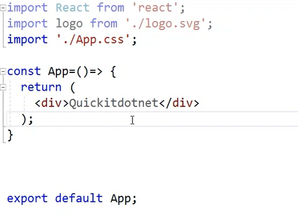
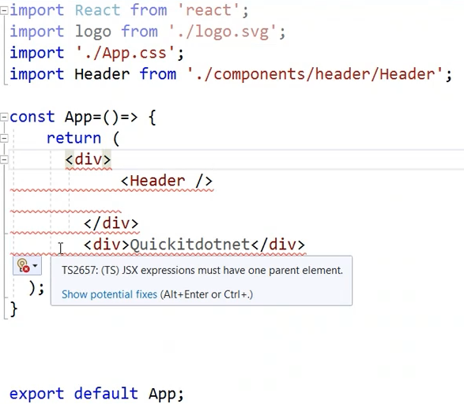
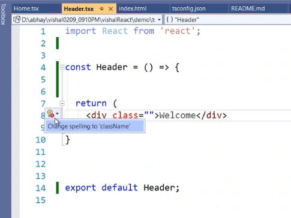
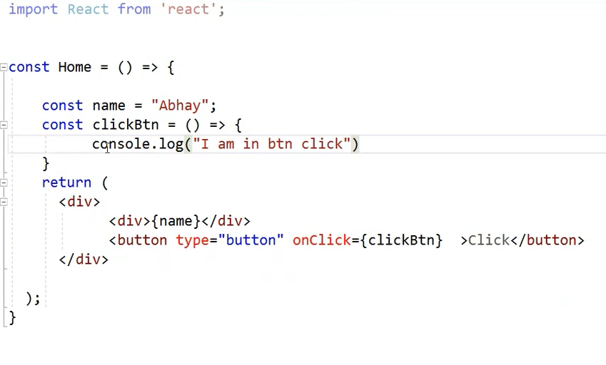
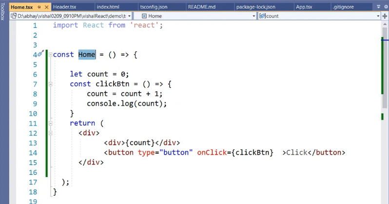
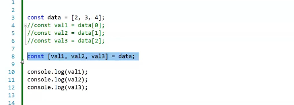
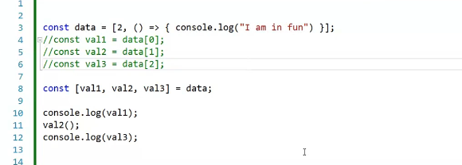
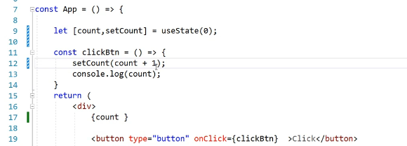
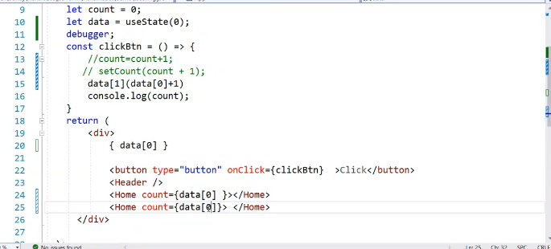

# React

1. What is react js?
    * React js is a UI rendering library.

2. Why react js?
   1. JS was different for each browser.
   2. JQuery (2009) provided common way to write JS for multiple browsers.
   3. Primary logic was based on HTML elements using tags, classes and selectors.
   4. AngularJS KnockoutJS came up with idea of data based selection in 2011.
   5. Babel and TypeScript caniuse.com

3. Common web developer tasks -
   1. Forms  - CRUD, Validations
   2. Grids - Search, Sort, Pagination
   3. API calls, asynchronous programming
   4. Authentication, Authorization
   5. Popup, Toast, Accordion, Tabs
   6. Routing
   7. Third party library integration - maps, datepickers

4. Building blocks
   1. Components
      1. Communication -
         1. one to many
         2. parent to child
         3. child to parent
   2. Redux
   3. Change Detection -
        1. useState()

5. Setting up react
    1. Install Node.js - node.js is runtime environment for JavaScript. It is based on v8 engine of chrome browser. What are responsibilities of runtime? - GC
       1. Run `node --version` or `node -v` to verify installation.
       2. Run `npm --version` or `npm -v` to verify if node package manager is available.
          * npm is used to install library packages into project.
          * npm is also used to run scripts. eg `npm start`.
          * Run `npm install create-react-app -g` to install package that provides us boilerplate project. -g option installs package globally
            * Windows - C:\Users\UserName\AppData\Roaming\npm
          * Run `npx create-react-app projectName` use `-template=typescript` if language to be used is typescript
          * Use `npm start` to run the application.

6. Important files
   1. package.json and package.lock.json
   2. Components - .ts and .tsx files
      1. index.tsx - startup component has selector for App.tsx
      2. environment.ts - environment specific constants
   3. index.html -  
   4. index.css - global css file
   5. tsconfig.json - has target for transpiler eg. es5

7. Components - 4 types (3 obsolete from 16.8)
   1. every function we write is considered as component
   
   2. create a new tsx file and add a function returning a `
 or fragment`.
      1. there can be only 1 parent element inside `
 or fragment` being returned similar to xml.
      
      2. `class` attribute can not be used use `className` attribute instead. 
   3. Declare variables and methods to handle events inside the function. Use interpolation `{variablename}` 
   4. `export default ClassName;`
   5. Use Component name as tag
   6. Once pure function returns we can no longer track changes on UI. 
      1. To solve this use `useState(0)`
         1. `let [variable, dispatchSetState() callback] = useState(0)`
         2. 
         3. 
         4. 
         5. 
      2. To solve this use `props`
      3. To solve this use `hooks`